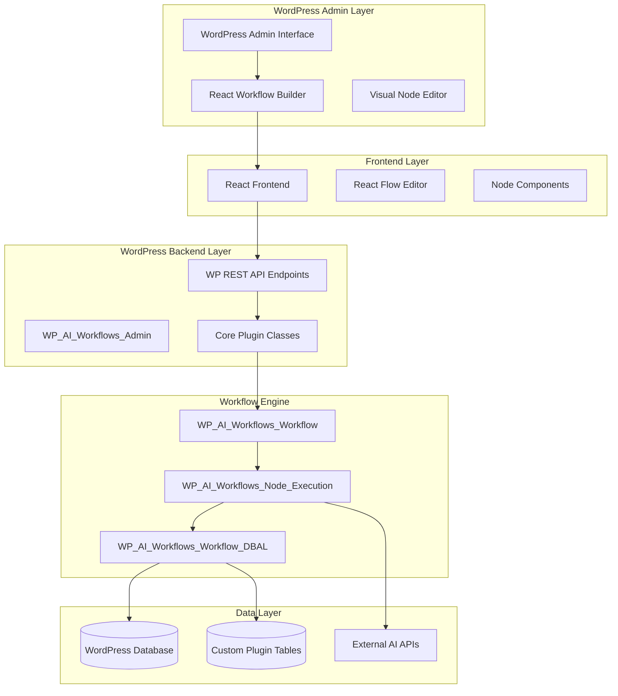

# [Feature Name] Design Document - WP AI Workflow Automation Pro

## Overview

[Provide a brief description of the feature and its purpose. Explain how it fits into the WP AI Workflow Automation Pro ecosystem and what problem it solves for WordPress users building AI workflows.]

## Architecture

### High-Level Architecture



### Technology Stack

**Frontend Components**
- React 18+ with hooks for workflow builder interface
- React Flow for visual node-based workflow editing
- Ant Design components for consistent UI
- Axios for WordPress REST API communication
- Local state management with React hooks

**WordPress Backend Services**
- WordPress REST API for frontend communication
- Custom PHP classes following WordPress coding standards
- WordPress database abstraction layer ($wpdb)
- Custom database tables for workflow data
- WordPress hooks and filters for extensibility

**Infrastructure**
- WordPress plugin architecture
- WordPress multisite compatibility
- License validation system
- WordPress cron for scheduled workflows
- WordPress user capabilities for access control

## Components and Interfaces

### Core WordPress Classes

#### 1. Main Workflow Class
```php
class WP_AI_Workflows_Workflow {
    /**
     * Execute workflow with given trigger data
     */
    public function execute_workflow($workflow_id, $trigger_data = array());
    
    /**
     * Validate workflow configuration
     */
    public function validate_workflow($workflow_data);
    
    /**
     * Schedule workflow execution
     */
    public function schedule_workflow($workflow_id, $schedule_time);
}
```

#### 2. Node Execution Service
```php
class WP_AI_Workflows_Node_Execution {
    /**
     * Execute individual node
     */
    public function execute_node($node_data, $context_data);
    
    /**
     * Process node connections and data flow
     */
    public function process_node_connections($node_id, $output_data);
    
    /**
     * Handle node errors and retries
     */
    public function handle_node_error($node_id, $error, $retry_count = 0);
}
```

### REST API Endpoints

#### Workflow Management
```php
// POST /wp-json/wp-ai-workflows/v1/workflows
class WP_AI_Workflows_REST_API {
    /**
     * Create new workflow
     */
    public function create_workflow(WP_REST_Request $request);
    
    /**
     * Update existing workflow
     */
    public function update_workflow(WP_REST_Request $request);
    
    /**
     * Execute workflow
     */
    public function execute_workflow(WP_REST_Request $request);
}
```

#### Node Configuration
```php
// GET /wp-json/wp-ai-workflows/v1/nodes/config
interface NodeConfigResponse {
    node_types: array,
    lite_restrictions: array,
    pro_features: array
}
```

### React Frontend Interfaces

#### Workflow Builder Component
```typescript
interface WorkflowBuilderProps {
    workflowId?: string;
    initialData?: WorkflowData;
    onSave: (workflowData: WorkflowData) => void;
    onExecute: (workflowId: string) => void;
}

interface WorkflowData {
    id: string;
    name: string;
    nodes: FlowNode[];
    edges: FlowEdge[];
    triggers: TriggerConfig[];
    settings: WorkflowSettings;
}
```

#### Node Component Interface
```typescript
interface NodeProps {
    data: NodeData;
    onUpdate: (nodeId: string, updates: Partial<NodeData>) => void;
    onDelete: (nodeId: string) => void;
    isProVersion: boolean;
}

interface NodeData {
    id: string;
    type: string;
    label: string;
    config: Record<string, any>;
    position: { x: number; y: number };
}
```

### Database Schema

#### WordPress Custom Tables
```sql
-- Workflows table
CREATE TABLE wp_ai_workflows (
    id bigint(20) unsigned NOT NULL AUTO_INCREMENT,
    name varchar(255) NOT NULL,
    description text,
    workflow_data longtext NOT NULL,
    status varchar(20) DEFAULT 'draft',
    created_at datetime DEFAULT CURRENT_TIMESTAMP,
    updated_at datetime DEFAULT CURRENT_TIMESTAMP ON UPDATE CURRENT_TIMESTAMP,
    PRIMARY KEY (id),
    KEY status (status),
    KEY created_at (created_at)
);

-- Workflow executions table
CREATE TABLE wp_ai_workflow_executions (
    id bigint(20) unsigned NOT NULL AUTO_INCREMENT,
    workflow_id bigint(20) unsigned NOT NULL,
    status varchar(20) NOT NULL,
    trigger_data longtext,
    execution_log longtext,
    started_at datetime DEFAULT CURRENT_TIMESTAMP,
    completed_at datetime NULL,
    PRIMARY KEY (id),
    KEY workflow_id (workflow_id),
    KEY status (status),
    FOREIGN KEY (workflow_id) REFERENCES wp_ai_workflows(id) ON DELETE CASCADE
);
```

#### WordPress Options Integration
```php
// Plugin settings stored in wp_options
interface PluginSettings {
    api_keys: array,
    default_models: array,
    cost_limits: array,
    security_settings: array
}
```

## Error Handling

### WordPress Error Handling Strategy

#### 1. API Response Errors
```php
class WP_AI_Workflows_Error_Handler {
    public static function handle_api_error($error) {
        return new WP_Error(
            $error['code'],
            $error['message'],
            array('status' => $error['status'])
        );
    }
    
    public static function handle_workflow_error($workflow_id, $error) {
        // Log error to WordPress debug log
        error_log("Workflow {$workflow_id} error: " . $error);
        
        // Store error in execution log
        $this->log_execution_error($workflow_id, $error);
        
        return $this->format_error_response($error);
    }
}
```

#### 2. Frontend Error Handling
```typescript
interface ErrorBoundaryState {
    hasError: boolean;
    error: Error | null;
    errorInfo: ErrorInfo | null;
}

class WorkflowBuilderErrorBoundary extends React.Component<Props, ErrorBoundaryState> {
    componentDidCatch(error: Error, errorInfo: ErrorInfo) {
        // Log error to WordPress admin
        this.logErrorToWordPress(error, errorInfo);
    }
}
```

### Node Execution Error Recovery
```php
class WP_AI_Workflows_Node_Recovery {
    /**
     * Implement retry logic for failed nodes
     */
    public function retry_node_execution($node_id, $max_retries = 3);
    
    /**
     * Skip failed node and continue workflow
     */
    public function skip_failed_node($node_id, $reason);
    
    /**
     * Pause workflow for manual intervention
     */
    public function pause_workflow_for_intervention($workflow_id, $node_id);
}
```

## Testing Strategy

### WordPress Plugin Testing Approach

#### 1. Unit Tests (40%)
```php
class Test_WP_AI_Workflows_Workflow extends WP_UnitTestCase {
    public function test_workflow_creation() {
        $workflow = new WP_AI_Workflows_Workflow();
        $result = $workflow->create_workflow($this->sample_workflow_data());
        
        $this->assertIsInt($result);
        $this->assertGreaterThan(0, $result);
    }
    
    public function test_node_execution() {
        $executor = new WP_AI_Workflows_Node_Execution();
        $result = $executor->execute_node($this->sample_node_data());
        
        $this->assertTrue($result['success']);
        $this->assertArrayHasKey('output', $result);
    }
}
```

#### 2. Integration Tests (35%)
```php
class Test_WP_AI_Workflows_Integration extends WP_UnitTestCase {
    public function test_complete_workflow_execution() {
        // Test entire workflow from trigger to completion
        $workflow_id = $this->create_test_workflow();
        $result = $this->execute_workflow_with_trigger($workflow_id);
        
        $this->assertEquals('completed', $result['status']);
    }
    
    public function test_rest_api_endpoints() {
        // Test all REST API endpoints
        $request = new WP_REST_Request('POST', '/wp-ai-workflows/v1/workflows');
        $response = rest_do_request($request);
        
        $this->assertEquals(200, $response->get_status());
    }
}
```

#### 3. Frontend Tests (25%)
```typescript
describe('WorkflowBuilder Component', () => {
    it('should create new workflow', async () => {
        render(<WorkflowBuilder onSave={mockSave} />);
        
        // Test workflow creation flow
        await user.click(screen.getByText('New Workflow'));
        await user.type(screen.getByLabelText('Workflow Name'), 'Test Workflow');
        
        expect(mockSave).toHaveBeenCalledWith(expect.objectContaining({
            name: 'Test Workflow'
        }));
    });
    
    it('should handle node drag and drop', async () => {
        const { container } = render(<WorkflowBuilder />);
        
        // Test React Flow node interactions
        const node = screen.getByTestId('ai-model-node');
        await user.drag(node, { delta: { x: 100, y: 50 } });
        
        expect(mockOnNodeUpdate).toHaveBeenCalled();
    });
});
```

### Testing Tools and Configuration

**WordPress Unit Testing**
- WordPress PHPUnit test suite
- WordPress test database setup
- Mock WordPress functions and hooks
- Test data factories for workflows and nodes

**Frontend Testing**
- Jest for React component testing
- React Testing Library for user interactions
- Mock WordPress REST API responses
- Cypress for E2E workflow testing

**WordPress Integration Testing**
- WordPress multisite testing
- Plugin activation/deactivation testing
- Database schema validation
- WordPress hook and filter testing

## WordPress-Specific Considerations

### Plugin Architecture Integration
```php
interface WordPressIntegration {
    /**
     * WordPress hooks and filters
     */
    public function register_hooks();
    
    /**
     * WordPress capabilities and permissions
     */
    public function check_user_permissions();
    
    /**
     * WordPress multisite compatibility
     */
    public function handle_multisite_activation();
}
```

### WordPress Security Implementation
```php
class WP_AI_Workflows_Security {
    /**
     * Sanitize and validate all input
     */
    public function sanitize_workflow_data($data);
    
    /**
     * Check WordPress nonces
     */
    public function verify_nonce($nonce, $action);
    
    /**
     * Escape output for WordPress
     */
    public function escape_workflow_output($output);
}
```

### WordPress Performance Optimization
- WordPress object caching integration
- Database query optimization with $wpdb
- WordPress transients for API response caching
- WordPress cron optimization for scheduled workflows
- Plugin lazy loading for large workflows

## License and Feature Management

### Pro vs Lite Feature Control
```php
class WP_AI_Workflows_License {
    /**
     * Check if feature is available in current license
     */
    public function is_feature_available($feature_name);
    
    /**
     * Get feature restrictions for frontend
     */
    public function get_feature_restrictions();
    
    /**
     * Validate license key
     */
    public function validate_license($license_key);
}
```

### Frontend Feature Gating
```typescript
interface FeatureGateProps {
    feature: string;
    fallback?: React.ReactNode;
    children: React.ReactNode;
}

const FeatureGate: React.FC<FeatureGateProps> = ({ feature, fallback, children }) => {
    const { isFeatureAvailable } = useLicense();
    
    if (!isFeatureAvailable(feature)) {
        return fallback || <ProUpgradePrompt feature={feature} />;
    }
    
    return <>{children}</>;
};
```

## WordPress Integration Points

### Form Plugin Integrations
- Gravity Forms hooks and filters
- WPForms action integration
- Contact Form 7 event handling
- Ninja Forms submission processing

### WordPress Event Triggers
- Post publication triggers
- User registration triggers
- Comment submission triggers
- WooCommerce order triggers

### WordPress Output Integration
- Custom post type creation
- User meta field updates
- WordPress email integration
- Media library integration

## Migration and WordPress Updates

### Plugin Update Strategy
```php
class WP_AI_Workflows_Updater {
    /**
     * Handle database schema updates
     */
    public function update_database_schema($old_version, $new_version);
    
    /**
     * Migrate workflow data formats
     */
    public function migrate_workflow_data($workflows);
    
    /**
     * Handle WordPress version compatibility
     */
    public function check_wordpress_compatibility();
}
```

### Backward Compatibility
- Maintain support for 2 previous WordPress versions
- Graceful degradation for unsupported features
- Migration path for legacy workflow formats
- Settings migration for plugin updates

## Assumptions and Dependencies

### WordPress Environment Assumptions
- WordPress 5.0+ with REST API enabled
- PHP 7.4+ with required extensions
- MySQL 5.6+ or MariaDB equivalent
- WordPress user capability system in use

### External Dependencies
- OpenAI API, Anthropic API, Google AI APIs
- WordPress REST API functionality
- Browser support for modern JavaScript (ES2020+)
- Server support for WordPress cron jobs

### Risk Mitigation
- Fallback for missing WordPress features
- API rate limit handling and queuing
- Database backup before major updates
- Plugin conflict detection and resolution

---

**Requirements Traceability**: This design addresses WordPress plugin requirements and AI workflow automation needs

**Review Status**: [Draft/In Review/Approved]

**WordPress Compatibility**: WordPress 5.0+, PHP 7.4+, MySQL 5.6+

**Last Updated**: [Date]

**Reviewers**: [List of reviewers]